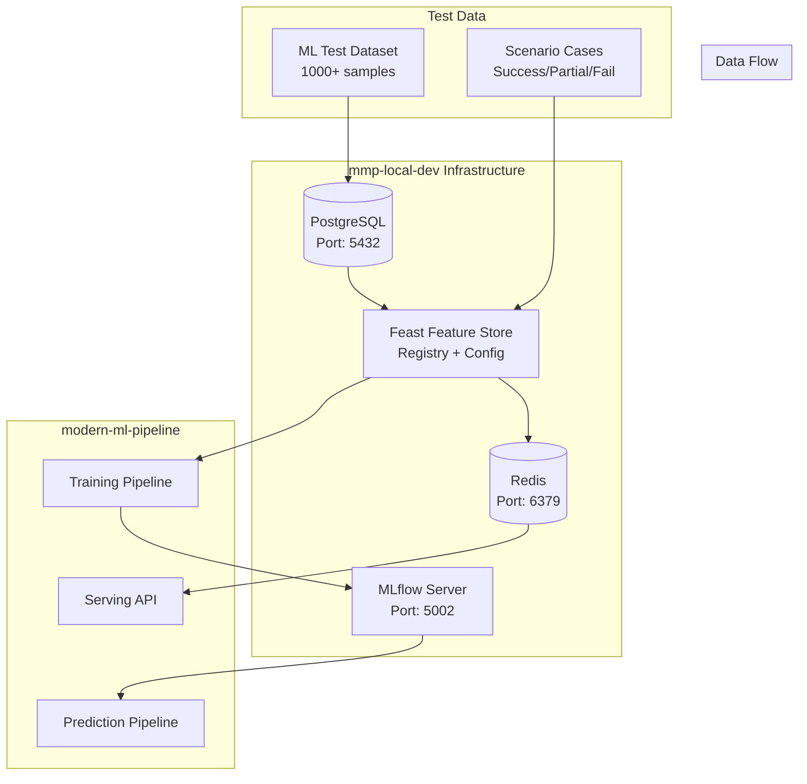

# 🚀 MMP Local Dev Environment

> **Modern ML Pipeline (MMP) 로컬 개발 환경**  
> PostgreSQL + Redis + MLflow + Feast Feature Store 완전 통합 개발 스택

[](https://opensource.org/licenses/MIT)
[](https://www.python.org/downloads/)
[](https://www.docker.com/)

---

## 📖 **개요**

**mmp-local-dev**는 [modern-ml-pipeline](../modern-ml-pipeline/) 프로젝트의 **완전한 개발 환경 백본**입니다.  
MLflow Graceful Degradation 패턴을 구현하여, modern-ml-pipeline이 3가지 모드에서 동작할 수 있게 지원합니다:

- **🔥 Full Stack Mode**: mmp-local-dev의 모든 인프라 서비스 활용
- **📁 Local File Mode**: MLflow 파일 저장, 로컬 Feature Store  
- **☁️ Production Mode**: 클라우드 MLflow, 프로덕션 Feature Store

### **🎯 핵심 가치**
- **Zero Setup**: 5분 내 완전한 ML 개발 환경 구축
- **Full Stack**: 데이터 → Feature Store → ML Pipeline → Serving 전체 흐름
- **Test Ready**: modern-ml-pipeline의 모든 테스트 시나리오 지원
- **Contract-Based**: dev-contract.yml 기반 엄격한 API 계약

---

## 🏗️ **아키텍처**



### **서비스 구성**

| 서비스 | 포트 | 역할 | 데이터 저장 |
|-------|------|------|-----------|
| **PostgreSQL** | 5432 | Feast Offline Store | `/var/lib/postgresql/data` |
| **Redis** | 6379 | Feast Online Store | `/data` |
| **MLflow** | 5002 | 실험 추적 & 모델 레지스트리 | `./mlflow-artifacts/` |
| **Feast** | - | Feature Store 레지스트리 | `./feast/data/` |

---

## ⚡ **빠른 시작**

### **1. 사전 준비**
```bash
# Docker 환경 확인 (Docker Desktop 또는 OrbStack)
docker --version
docker-compose --version

# 프로젝트 클론
git clone <repository-url>
cd mmp-local-dev
```

### **2. 환경 설정 & 실행**
```bash
# 한 번에 모든 환경 구축
./setup.sh

# 🎉 완료! 모든 서비스가 자동으로 시작됩니다
```

### **3. 연결 테스트**
```bash
# 통합 테스트 실행
python test-integration.py

# 개별 서비스 확인
./setup.sh --status
```

### **4. Modern ML Pipeline 실행**
```bash
# MMP 디렉토리로 이동
cd ../modern-ml-pipeline

# DEV 환경에서 학습 실행
APP_ENV=dev uv run python main.py train --recipe-file dev_classification_test

# API 서빙 시작
APP_ENV=dev uv run python main.py serve-api --run-id latest
```

---

## 🗄️ **데이터베이스 스키마**

### **Feature Store 스키마 (features)**

mmp-local-dev는 **4개 핵심 피처 테이블**을 제공합니다:

#### **1. user_demographics** - 사용자 기본 정보
```sql
CREATE TABLE features.user_demographics (
    user_id VARCHAR(50) PRIMARY KEY,        -- Entity: 사용자 식별자
    age INTEGER,                            -- 연령
    country_code VARCHAR(2),                -- 국가 코드 (ISO 2자리)
    created_at TIMESTAMP DEFAULT CURRENT_TIMESTAMP
);
```

#### **2. user_purchase_summary** - 구매 요약
```sql
CREATE TABLE features.user_purchase_summary (
    user_id VARCHAR(50) PRIMARY KEY,
    ltv DECIMAL(10,2),                      -- Life Time Value
    total_purchase_count INTEGER,           -- 총 구매 횟수
    last_purchase_date DATE,                -- 마지막 구매일
    created_at TIMESTAMP DEFAULT CURRENT_TIMESTAMP
);
```

#### **3. product_details** - 상품 정보
```sql
CREATE TABLE features.product_details (
    product_id VARCHAR(50) PRIMARY KEY,     -- Entity: 상품 식별자
    price DECIMAL(10,2),                    -- 가격
    category VARCHAR(100),                  -- 카테고리
    brand VARCHAR(100),                     -- 브랜드
    created_at TIMESTAMP DEFAULT CURRENT_TIMESTAMP
);
```

#### **4. session_summary** - 세션 요약
```sql
CREATE TABLE features.session_summary (
    session_id VARCHAR(50) PRIMARY KEY,     -- Entity: 세션 식별자
    time_on_page_seconds INTEGER,           -- 페이지 체류 시간
    click_count INTEGER,                    -- 클릭 수
    created_at TIMESTAMP DEFAULT CURRENT_TIMESTAMP
);
```

### **현재 데이터 현황**
- **user_demographics**: 100개 사용자 (user_001 ~ user_100)
- **user_purchase_summary**: 100개 구매 요약
- **product_details**: 50개 상품 (prod_001 ~ prod_050)  
- **session_summary**: 200개 세션 (sess_001 ~ sess_200)

---

## 🧪 **ML 테스트 데이터 통합**

### **modern-ml-pipeline 호환성**

mmp-local-dev는 modern-ml-pipeline의 **모든 Recipe와 100% 호환**되도록 설계되었습니다.

#### **핵심 호환 테이블: `ml_test_dataset`**

modern-ml-pipeline의 `local_classification_test` Recipe와 완벽 호환:

```sql
CREATE TABLE features.ml_test_dataset (
    -- Entity 스키마 (Recipe 필수)
    user_id VARCHAR(50),                    -- 사용자 식별자
    event_timestamp TIMESTAMP,              -- 이벤트 타임스탬프
    
    -- ML Features (Recipe 정의)
    age INTEGER,                            -- 연령
    income DECIMAL(10,2),                   -- 소득
    credit_score INTEGER,                   -- 신용 점수  
    region VARCHAR(20),                     -- 지역 (North/South/East/West)
    occupation VARCHAR(50),                 -- 직업 (Engineer/Teacher/Doctor/Other)
    
    -- Target Variable
    approved INTEGER,                       -- 승인 여부 (0/1)
    
    -- Meta
    created_at TIMESTAMP DEFAULT CURRENT_TIMESTAMP
);
```

### **데이터 추가 가이드**

#### **Step 1: 기본 ML 테스트 데이터 생성**

```bash
# 1. 스크립트 생성
cat > scripts/seed-ml-test-data.sql << 'EOF'
-- Modern ML Pipeline 호환 테스트 데이터
SET search_path TO features, public;

-- ML 테스트 데이터 테이블 생성
CREATE TABLE IF NOT EXISTS ml_test_dataset (
    user_id VARCHAR(50),
    event_timestamp TIMESTAMP,
    age INTEGER,
    income DECIMAL(10,2),
    credit_score INTEGER,
    region VARCHAR(20),
    occupation VARCHAR(50),
    approved INTEGER,
    created_at TIMESTAMP DEFAULT CURRENT_TIMESTAMP
);

-- 기존 Feature Store 사용자와 교집합 보장하는 1000개 샘플 생성
INSERT INTO ml_test_dataset (user_id, event_timestamp, age, income, credit_score, region, occupation, approved)
SELECT 
    CASE 
        WHEN ROW_NUMBER() OVER() <= 100 THEN 'user_' || LPAD(ROW_NUMBER() OVER()::text, 3, '0')  -- 기존 사용자 활용
        ELSE 'test_user_' || (ROW_NUMBER() OVER() - 100)  -- 새 테스트 사용자
    END as user_id,
    CURRENT_TIMESTAMP + (ROW_NUMBER() OVER() * INTERVAL '1 hour') as event_timestamp,
    (RANDOM() * 30 + 25)::INTEGER as age,  -- 25-55세
    (EXP(RANDOM() * 2 + 9))::DECIMAL(10,2) as income,  -- 로그정규분포 소득
    (RANDOM() * 550 + 300)::INTEGER as credit_score,  -- 300-850 신용점수
    CASE (RANDOM() * 4)::INTEGER 
        WHEN 0 THEN 'North'
        WHEN 1 THEN 'South' 
        WHEN 2 THEN 'East'
        ELSE 'West'
    END as region,
    CASE (RANDOM() * 4)::INTEGER
        WHEN 0 THEN 'Engineer'
        WHEN 1 THEN 'Teacher'
        WHEN 2 THEN 'Doctor' 
        ELSE 'Other'
    END as occupation,
    CASE WHEN RANDOM() < 0.35 THEN 1 ELSE 0 END as approved  -- 35% 승인율
FROM generate_series(1, 1000);

-- 인덱스 생성 (성능 최적화)
CREATE INDEX IF NOT EXISTS idx_ml_test_dataset_user_id ON ml_test_dataset(user_id);
CREATE INDEX IF NOT EXISTS idx_ml_test_dataset_event_timestamp ON ml_test_dataset(event_timestamp);

ANALYZE ml_test_dataset;
EOF

# 2. 데이터 투입
docker-compose exec -T postgresql psql -U mluser -d mlpipeline < scripts/seed-ml-test-data.sql
```

#### **Step 2: 시나리오별 테스트 케이스 생성**

```bash
# 테스트 시나리오 테이블 생성
cat > scripts/seed-test-scenarios.sql << 'EOF'
SET search_path TO features, public;

-- 시나리오별 테스트 케이스 테이블
CREATE TABLE IF NOT EXISTS feature_lookup_test (
    test_id SERIAL PRIMARY KEY,
    user_id VARCHAR(50),
    request_timestamp TIMESTAMP,
    test_scenario VARCHAR(50),              -- 'success', 'partial_fail', 'complete_fail'
    expected_features JSONB,                -- 예상 Feature Store 응답
    created_at TIMESTAMP DEFAULT CURRENT_TIMESTAMP
);

-- 성공 케이스 (200개): 모든 피처 완전 보유
INSERT INTO feature_lookup_test (user_id, request_timestamp, test_scenario, expected_features)
SELECT 
    'user_' || LPAD((ROW_NUMBER() OVER() % 100 + 1)::text, 3, '0'),
    CURRENT_TIMESTAMP,
    'success',
    jsonb_build_object(
        'age', ud.age,
        'country_code', ud.country_code,
        'ltv', ups.ltv,
        'total_purchase_count', ups.total_purchase_count
    )
FROM generate_series(1, 200), 
     features.user_demographics ud,
     features.user_purchase_summary ups
WHERE ud.user_id = ups.user_id
  AND ud.user_id = 'user_' || LPAD((ROW_NUMBER() OVER() % 100 + 1)::text, 3, '0')
LIMIT 200;

-- 부분 실패 케이스 (100개): 일부 피처 누락
INSERT INTO feature_lookup_test (user_id, request_timestamp, test_scenario, expected_features)
SELECT 
    'partial_user_' || generate_series,
    CURRENT_TIMESTAMP,
    'partial_fail', 
    jsonb_build_object('age', (RANDOM() * 30 + 25)::INTEGER)  -- age만 존재
FROM generate_series(1, 100);

-- 완전 실패 케이스 (50개): Feature Store 연결 불가
INSERT INTO feature_lookup_test (user_id, request_timestamp, test_scenario, expected_features)
SELECT 
    'fail_user_' || generate_series,
    CURRENT_TIMESTAMP,
    'complete_fail',
    '{}'::jsonb  -- 빈 응답
FROM generate_series(1, 50);
EOF

# 실행
docker-compose exec -T postgresql psql -U mluser -d mlpipeline < scripts/seed-test-scenarios.sql
```

#### **Step 3: Feature Store Materialization**

```python
# scripts/materialize-features.py
#!/usr/bin/env python3
"""Feature Store 데이터를 Redis Online Store로 Materialize"""

import os
import sys
from datetime import datetime, timedelta
import pandas as pd

# Feast 디렉토리로 이동
os.chdir('./feast')

try:
    from feast import FeatureStore
    
    # Feature Store 인스턴스 생성
    fs = FeatureStore(repo_path=".")
    
    print("🔄 Feature Store Materialization 시작...")
    
    # 전체 피처 뷰에 대해 materialization 수행
    feature_views = fs.list_feature_views()
    
    for fv in feature_views:
        print(f"📊 {fv.name} materialization 중...")
        
        # 지난 30일부터 현재까지의 데이터를 materialize
        start_date = datetime.now() - timedelta(days=30)
        end_date = datetime.now()
        
        fs.materialize_incremental(
            feature_views=[fv],
            end_date=end_date
        )
        
        print(f"✅ {fv.name} materialization 완료")
    
    print("🎉 전체 Feature Store Materialization 완료!")
    
    # 테스트: 샘플 데이터 조회
    print("\n📋 테스트: 샘플 피처 조회")
    entity_df = pd.DataFrame({
        "user_id": ["user_001", "user_002", "user_003"],
        "event_timestamp": [datetime.now()] * 3
    })
    
    online_features = fs.get_online_features(
        features=[
            "user_demographics:age",
            "user_demographics:country_code", 
            "user_purchase_summary:ltv"
        ],
        entity_rows=[
            {"user_id": "user_001"},
            {"user_id": "user_002"}, 
            {"user_id": "user_003"}
        ]
    )
    
    print("✅ Online Feature 조회 성공:")
    print(online_features.to_dict())
    
except Exception as e:
    print(f"❌ Materialization 실패: {str(e)}")
    sys.exit(1)
```

```bash
# Materialization 실행
python scripts/materialize-features.py
```

### **데이터 검증**

```bash
# 1. 데이터 건수 확인
docker-compose exec -T postgresql psql -U mluser -d mlpipeline -c "
SELECT 
    'user_demographics' as table_name, COUNT(*) as row_count 
FROM features.user_demographics
UNION ALL
SELECT 
    'ml_test_dataset', COUNT(*) 
FROM features.ml_test_dataset
UNION ALL  
SELECT 
    'feature_lookup_test', COUNT(*)
FROM features.feature_lookup_test;
"

# 2. Feature Store 연결 테스트
cd feast && feast validate

# 3. Redis 데이터 확인
docker-compose exec redis redis-cli --scan --pattern "*user_demographics*" | head -10
```

---

## 🧪 **테스트 실행**

### **통합 테스트**
```bash
# 전체 스택 검증
python test-integration.py

# 예상 출력:
# ✅ PASS 계약 준수 (Contract Compliance)
# ✅ PASS PostgreSQL 연결  
# ✅ PASS Redis 연결
# ✅ PASS MLflow 서버
# ✅ PASS Feast 피처
# 🎉 총 5개 테스트 중 5개 통과 (100.0%)
```

### **Modern ML Pipeline 테스트**
```bash
cd ../modern-ml-pipeline

# 1. Unit 테스트 (독립 실행 가능)
uv run pytest tests/unit/ -v

# 2. Integration 테스트 (DEV 스택 필요)
APP_ENV=dev uv run pytest tests/integration/ -v

# 3. E2E 테스트 (전체 워크플로우)
APP_ENV=dev uv run pytest tests/e2e/ -v

# 4. Feature Store 정합성 테스트
uv run pytest tests/integration/test_feature_store_parity.py -v
uv run pytest tests/integration/test_feature_store_point_in_time.py -v
```

### **Serving API 테스트**
```bash
# API 서버 시작
APP_ENV=dev uv run python main.py serve-api --run-id latest &

# API 테스트
curl -X POST "http://localhost:8000/predict" \
  -H "Content-Type: application/json" \
  -d '{
    "user_id": "user_001",
    "age": 35,
    "income": 75000,
    "credit_score": 720,
    "region": "North",
    "occupation": "Engineer"
  }'

# 예상 응답 (DEV 환경):
# {"prediction": 1, "probability": 0.73, "status": "success"}

# 예상 응답 (Local 환경):  
# {"error": "Feature Store unavailable", "status_code": 503}
```

---

## 📊 **Feature Store 활용**

### **Feast 피처 조회**

#### **Historical Features (Offline Store)**
```python
from feast import FeatureStore
import pandas as pd
from datetime import datetime

# Feature Store 초기화  
fs = FeatureStore(repo_path="./feast")

# 엔티티 DataFrame 준비
entity_df = pd.DataFrame({
    "user_id": ["user_001", "user_002", "user_003"],
    "event_timestamp": [datetime.now()] * 3
})

# Historical features 조회 (학습용)
training_df = fs.get_historical_features(
    entity_df=entity_df,
    features=[
        "user_demographics:age",
        "user_demographics:country_code",
        "user_purchase_summary:ltv",
        "user_purchase_summary:total_purchase_count"
    ]
).to_df()

print("📊 Historical Features:")
print(training_df.head())
```

#### **Online Features (Redis)**
```python
# Online features 조회 (실시간 예측용)
online_features = fs.get_online_features(
    features=[
        "user_demographics:age",
        "user_purchase_summary:ltv"
    ],
    entity_rows=[
        {"user_id": "user_001"},
        {"user_id": "user_002"}
    ]
)

print("⚡ Online Features:")
print(online_features.to_dict())
```

### **커스텀 피처 추가**

새로운 피처를 추가하려면:

#### **1. PostgreSQL에 테이블 생성**
```sql
-- 새로운 피처 테이블 예시
CREATE TABLE features.user_engagement (
    user_id VARCHAR(50) PRIMARY KEY,
    page_views INTEGER,
    session_duration_avg DECIMAL(8,2),
    bounce_rate DECIMAL(5,4),
    created_at TIMESTAMP DEFAULT CURRENT_TIMESTAMP
);

-- 샘플 데이터 삽입
INSERT INTO features.user_engagement (user_id, page_views, session_duration_avg, bounce_rate)
SELECT 
    user_id,
    (RANDOM() * 100 + 10)::INTEGER,  -- 10-110 페이지뷰
    (RANDOM() * 300 + 60)::DECIMAL(8,2),  -- 60-360초 세션
    (RANDOM() * 0.5 + 0.1)::DECIMAL(5,4)  -- 10-60% 바운스율
FROM features.user_demographics;
```

#### **2. Feast FeatureView 정의**
```python
# feast/features.py에 추가
user_engagement_source = PostgreSQLSource(
    name="user_engagement_source",
    query="SELECT user_id, page_views, session_duration_avg, bounce_rate, created_at FROM features.user_engagement",
    timestamp_field="created_at"
)

user_engagement_fv = FeatureView(
    name="user_engagement",
    entities=[user],  # 기존 user entity 재사용
    ttl=timedelta(days=7),
    schema=[
        Field(name="page_views", dtype=Int64),
        Field(name="session_duration_avg", dtype=Float32),
        Field(name="bounce_rate", dtype=Float32),
    ],
    source=user_engagement_source
)
```

#### **3. Feature Store 업데이트**
```bash
cd feast
feast apply  # 새 FeatureView 등록
feast materialize-incremental $(date -d '1 day ago' +%Y-%m-%d) $(date +%Y-%m-%d)  # Materialize
```

---

## 🛠️ **환경 관리**

### **서비스 제어**
```bash
# 전체 환경 재시작
./setup.sh

# 서비스 상태 확인
./setup.sh --status
docker-compose ps

# 서비스 중지
./setup.sh --stop
# 또는
docker-compose down

# 데이터 포함 완전 삭제
./setup.sh --clean
# 또는  
docker-compose down -v
```

### **개별 서비스 디버깅**
```bash
# PostgreSQL 직접 접속
docker-compose exec postgresql psql -U mluser -d mlpipeline

# Redis 직접 접속
docker-compose exec redis redis-cli

# MLflow 로그 확인
docker-compose logs mlflow

# Feast 설정 확인
cd feast && feast validate
```

### **성능 모니터링**
```bash
# 서비스 리소스 사용량
docker-compose ps --format "table {{.Name}}\t{{.Status}}\t{{.Size}}"

# PostgreSQL 연결 수
docker-compose exec postgresql psql -U mluser -d mlpipeline -c "
SELECT count(*) as active_connections 
FROM pg_stat_activity 
WHERE state = 'active';"

# Redis 메모리 사용량
docker-compose exec redis redis-cli info memory | grep used_memory_human

# 디스크 사용량
du -sh mlflow-artifacts/ feast/data/ 
```

---

## 🔧 **고급 설정**

### **환경변수 커스터마이징**

`.env` 파일을 수정하여 설정 변경:

```bash
# .env 파일 예시
POSTGRES_HOST=localhost
POSTGRES_PORT=5432  
POSTGRES_USER=mluser
POSTGRES_DB=mlpipeline
POSTGRES_PASSWORD=secure_password_123

REDIS_HOST=localhost
REDIS_PORT=6379

# MLflow 설정 - modern-ml-pipeline과 포트 통일 
MLFLOW_TRACKING_URI=http://localhost:5002

# 추가 설정
COMPOSE_PROJECT_NAME=mmp-local-dev
MLFLOW_ARTIFACT_ROOT=./mlflow-artifacts
```

### **Production 배포 준비**

```bash
# Production 환경변수 템플릿
cat > .env.production << 'EOF'
# Production PostgreSQL (외부 서버)
POSTGRES_HOST=prod-postgres.example.com
POSTGRES_PORT=5432
POSTGRES_USER=mlpipeline_prod
POSTGRES_DB=mlpipeline_prod
POSTGRES_PASSWORD=${POSTGRES_PROD_PASSWORD}

# Production Redis (외부 서버) 
REDIS_HOST=prod-redis.example.com
REDIS_PORT=6379
REDIS_PASSWORD=${REDIS_PROD_PASSWORD}

# Production MLflow (외부 서버)
MLFLOW_TRACKING_URI=https://mlflow.example.com

# S3 아티팩트 스토어
MLFLOW_S3_ENDPOINT_URL=https://s3.amazonaws.com
AWS_ACCESS_KEY_ID=${AWS_ACCESS_KEY_ID}
AWS_SECRET_ACCESS_KEY=${AWS_SECRET_ACCESS_KEY}
EOF
```

### **백업 및 복원**

```bash
# PostgreSQL 백업
docker-compose exec postgresql pg_dump -U mluser -d mlpipeline > backup_$(date +%Y%m%d).sql

# PostgreSQL 복원  
docker-compose exec -T postgresql psql -U mluser -d mlpipeline < backup_20240119.sql

# Redis 백업
docker-compose exec redis redis-cli --rdb dump.rdb
docker cp $(docker-compose ps -q redis):/data/dump.rdb ./redis_backup_$(date +%Y%m%d).rdb

# 전체 데이터 디렉토리 백업
tar -czf mmp_local_dev_backup_$(date +%Y%m%d).tar.gz \
  mlflow-artifacts/ \
  feast/data/ \
  postgres_data/ \
  redis_data/
```

---

## 🚨 **트러블슈팅**

### **자주 발생하는 문제**

#### **1. 포트 충돌**
```bash
# 포트 사용 중 확인
lsof -i :5432  # PostgreSQL
lsof -i :6379  # Redis  
lsof -i :5002  # MLflow

# 해결방법: 기존 프로세스 종료 후 재시작
./setup.sh --clean && ./setup.sh
```

#### **2. PostgreSQL 연결 실패**
```bash
# 로그 확인
docker-compose logs postgresql

# 연결 테스트
docker-compose exec postgresql psql -U mluser -d mlpipeline -c "SELECT 1;"

# 일반적 해결방법
docker-compose restart postgresql
```

#### **3. Feast 설정 오류**
```bash
# Feast 설정 검증
cd feast && feast validate

# 레지스트리 재생성
rm -rf data/registry.db
feast apply

# Materialization 재실행
feast materialize-incremental $(date -d '7 days ago' +%Y-%m-%d) $(date +%Y-%m-%d)
```

#### **4. MLflow 서버 접속 불가**
```bash
# MLflow 서버 로그 확인
docker-compose logs mlflow

# 수동 재시작
docker-compose restart mlflow

# 브라우저에서 확인
open http://localhost:5002
```

### **성능 문제**

#### **PostgreSQL 쿼리 최적화**
```sql
-- 느린 쿼리 식별
SELECT query, mean_time, calls 
FROM pg_stat_statements 
ORDER BY mean_time DESC 
LIMIT 10;

-- 인덱스 사용률 확인
SELECT schemaname, tablename, indexname, idx_tup_read, idx_tup_fetch 
FROM pg_stat_user_indexes 
ORDER BY idx_tup_read DESC;
```

#### **Redis 메모리 최적화**
```bash
# Redis 메모리 사용량 분석
docker-compose exec redis redis-cli --bigkeys

# 메모리 정책 확인
docker-compose exec redis redis-cli config get maxmemory-policy
```

---

## 🤝 **modern-ml-pipeline 통합 가이드**

### **개발 워크플로우**

#### **1. 새 ML 실험 시작**
```bash
# 1. mmp-local-dev 환경 시작
cd mmp-local-dev
./setup.sh

# 2. 데이터 확인 및 Feature Store 테스트
python test-integration.py

# 3. modern-ml-pipeline에서 실험
cd ../modern-ml-pipeline
APP_ENV=dev uv run python main.py train --recipe-file your_recipe

# 4. 결과 확인
open http://localhost:5002  # MLflow UI
```

#### **2. API 서빙 테스트**
```bash
# 1. 모델 학습 (위 단계 완료)

# 2. API 서버 시작 
APP_ENV=dev uv run python main.py serve-api --run-id latest

# 3. Feature Store 연동 테스트
curl -X POST "http://localhost:8000/predict" \
  -H "Content-Type: application/json" \
  -d '{"user_id": "user_001", "age": 35}'

# 4. 환경별 응답 정책 확인
# DEV (Feature Store 연결): HTTP 200 + 예측 결과
# LOCAL (Feature Store 미연결): HTTP 503 + 에러 메시지
```

#### **3. Feature Store 개발**
```bash
# 1. 새 피처 데이터 추가 (PostgreSQL)
docker-compose exec postgresql psql -U mluser -d mlpipeline
# > 새 테이블 생성 및 데이터 삽입

# 2. Feast FeatureView 정의 (feast/features.py)
# > 새 FeatureView 추가

# 3. Feature Store 업데이트
cd feast
feast apply
feast materialize-incremental $(date -d '1 day ago' +%Y-%m-%d) $(date +%Y-%m-%d)

# 4. modern-ml-pipeline에서 활용
# > Recipe 파일에 새 피처 추가
```

### **배포 시나리오**

#### **Local Development** 🏠
- mmp-local-dev 없이 modern-ml-pipeline만 실행
- MLflow: 로컬 파일 모드
- Feature Store: 파일 기반 또는 비활성화
- API: 503 응답 (Feature Store 미연결)

#### **Development** 🧪  
- mmp-local-dev + modern-ml-pipeline 연동
- MLflow: Docker 서버 (localhost:5002)
- Feature Store: PostgreSQL + Redis
- API: 200 응답 (완전 기능)

#### **Production** 🚀
- modern-ml-pipeline만 배포
- MLflow: 외부 서버 (https://mlflow.company.com)
- Feature Store: 프로덕션 인스턴스
- API: 200 응답 (프로덕션 데이터)

---

## 📚 **참고 자료**

### **관련 문서**
- [modern-ml-pipeline](../modern-ml-pipeline/README.md) - 메인 ML 파이프라인
- [dev-contract.yml](./dev-contract.yml) - API 계약서
- [Blueprint 아키텍처](../modern-ml-pipeline/.claude/BLUEPRINT.md) - 설계 철학
- [개발 계획](../modern-ml-pipeline/.claude/DEV_PLANS.md) - 로드맵

### **기술 스택 문서**
- [Docker Compose](https://docs.docker.com/compose/) - 컨테이너 오케스트레이션
- [PostgreSQL](https://www.postgresql.org/docs/) - 관계형 데이터베이스  
- [Redis](https://redis.io/documentation) - 인메모리 데이터 스토어
- [MLflow](https://mlflow.org/docs/latest/index.html) - ML 실험 추적
- [Feast](https://feast.dev/) - Feature Store

### **개발 도구**
- [OrbStack](https://orbstack.dev/) - macOS Docker 환경 (추천)
- [Docker Desktop](https://www.docker.com/products/docker-desktop/) - 크로스플랫폼 Docker
- [DBeaver](https://dbeaver.io/) - PostgreSQL GUI 클라이언트
- [Redis Insight](https://redis.io/insight/) - Redis GUI 클라이언트

---

## 🏷️ **버전 정보**

- **Version**: 1.0.0
- **Python**: 3.11+
- **Docker**: 20.10+
- **modern-ml-pipeline**: Compatible with all versions

### **변경 이력**
- **v1.0.0** (2024-01-19)
  - 초기 릴리스
  - PostgreSQL + Redis + MLflow + Feast 통합
  - modern-ml-pipeline 완전 호환
  - ML 테스트 데이터 1000+ 샘플 제공
  - 시나리오별 테스트 케이스 지원

---

## 📄 **라이센스**

MIT License - 자세한 내용은 [LICENSE](LICENSE) 파일을 참조하세요.

---

## 🙋‍♂️ **지원**

문제가 발생하거나 궁금한 점이 있으시면:

1. **통합 테스트 먼저 실행**: `python test-integration.py`
2. **로그 확인**: `docker-compose logs [service-name]` 
3. **이슈 리포트**: GitHub Issues에 상세한 정보와 함께 등록
4. **개발팀 연락**: 내부 Slack 채널 또는 이메일

---

<div align="center">

**🚀 Happy ML Development with mmp-local-dev! 🚀**

Made with ❤️ for Modern ML Pipeline

</div>